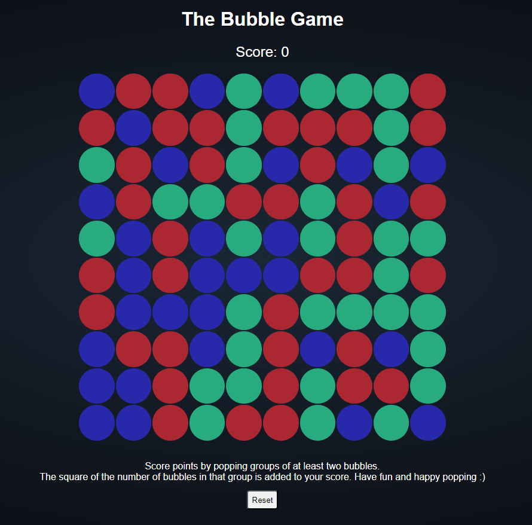
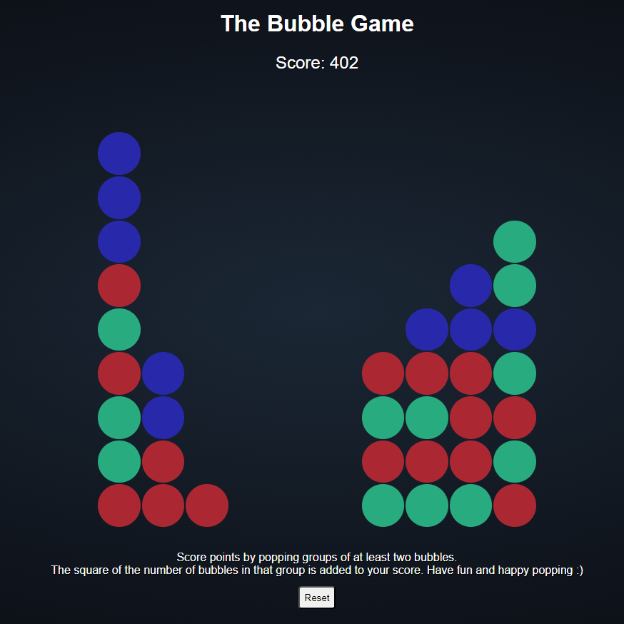
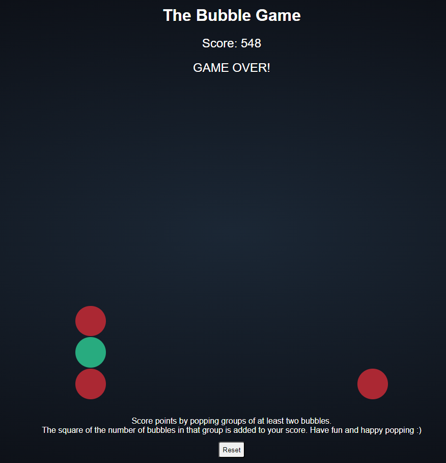

# Bubble Game

Score points by popping groups of at least two bubbles.
The square of the number of bubbles in that group is added to your score. Have fun and happy popping!

Built in Javascript, CSS & HTML.

Play the game [here](https://hengmhs.github.io/bubble/).

**Starting**

**Playing**

**Game Over**

